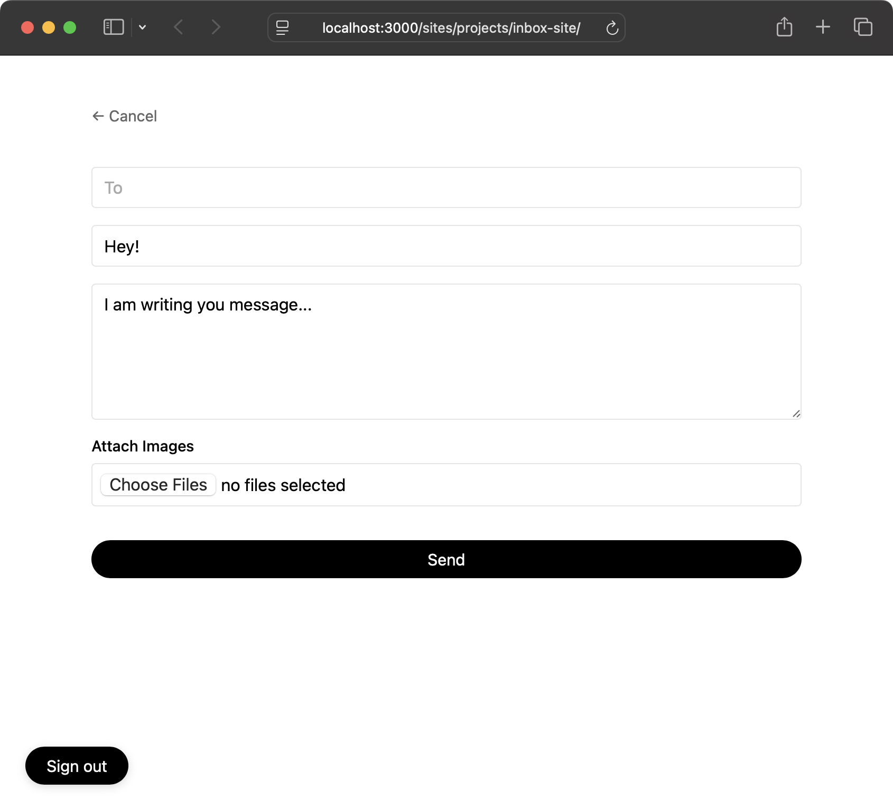
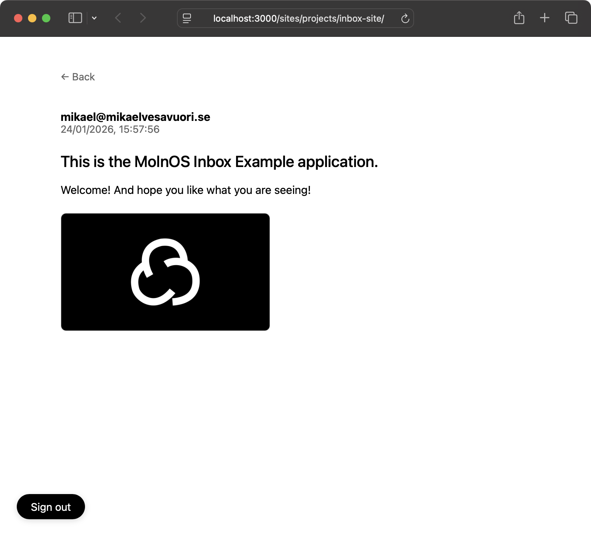

# MolnOS Example: Inbox

This project demonstrates a simple messaging application: **Inbox**.

It is composed of several common cloud primitives — adapted as needed — to work on [MolnOS](https://molnos.cloud).


_The main inbox._



_Drafting a message to someone._



_Reading a message._

The application allows you to privately read and write messages to other users on your MolnOS instance.

The capabilities demonstrated span the following:

- **Sites**: The web application is hosted on MolnOS as a static site.
- **Functions**: The app's backend is split into serverless functions.
- **Databases**: Message data is stored in a key-value database.
- **Storage**: Any image attachments for messages are stored in object storage.
- **Schemas**: A message schema is defined in the schema registry for validation.
- **Auth**: To enable MolnOS users to sign into the app, Application Registrations and passwordless (email) login is used.
- **Observability**: Logs stored for all posted messages.

_This is an example, not reference-style, application intended to demonstrate features. For production use, always make sure to go through in detail a solution like this one._

## Prerequisites

- MolnOS Core installed and running ([docs](https://docs.molnos.cloud))
- MolnOS CLI configured (`molnos auth configure`)
  - If you are not running MolnOS on the default `localhost:3000`, run `molnos configure url <your_molnos_url>`
- Make sure to register and start all MolnOS services.
- [Node.js](https://nodejs.org/en) installed
- Dependencies of this repo installed with `npm install`
- Modify the `molnos.json` (IAC config file) and its `applications.redirectUris` array to point to your MolnOS instance.

## Quick Start

**Make sure you follow any prerequisites first!**

Assuming you are running MolnOS locally (else modify to your remote API endpoint below):

```bash

# Install dependencies
npm install

# Deploy infrastructure (creates app registration, bucket, database, functions, site) with a convenience command
npm run deploy

# Done! Access at http://localhost:3000/sites/projects/inbox-site/
```

## Authentication

Uses **MolnOS Application Registration** with passwordless email login (magic links).

**Flow:** User enters email → receives magic link → clicks link → redirected to app with tokens → tokens stored in localStorage.

**Security:** Application whitelisting, redirect URI validation, token-based sessions with refresh capability.

## Project Structure

### Infrastructure Components

1. **Application Registration**: `inbox-app` - OAuth application credentials
2. **Database Table**: `inbox-messages` - Stores all messages
3. **Storage Bucket**: `inbox-bucket` - For file storage
4. **Schema**: `inbox-message` - Message validation schema in the registry
5. **Serverless Functions**: Three functions with database bindings
   - `get-message-list`: Lists all messages
   - `get-message`: Retrieves a specific message
   - `post-message`: Creates a new message
6. **Static Site**: Frontend application with auth callback

These are described in `molnos.json`, which is MolnOS' way to handle infrastructure-as-code.

The IaC configuration also uses **context attributes** to tag the deployment with metadata (`domain`, `tier`) for organizational purposes.

## Demo Mode

For testing without a MolnOS deployment, set demo mode in your browser console:

```javascript
localStorage.setItem('DEMO_DATA', 'true')
```

## Troubleshooting

### Authentication Flow Not Working

1. **Check Application Registration:**

   ```bash
   molnos apps list
   ```

   Verify your application is registered and has the correct redirect URI.

2. **Check Application ID in site:**

   Open [site/script.js](site/script.js) and verify `APP_ID` is set correctly.

3. **Verify Redirect URI:**
   The redirect URI must match exactly. Format: `http://localhost:3000/sites/projects/inbox-app/auth-callback.html`

4. **Check Browser Console:**
   Open browser DevTools (F12) and check for JavaScript errors during sign-in or callback.

5. **Check Email:**
   Magic link should arrive within seconds. Check spam folder if needed.

### "Invalid or missing authentication" Errors

1. Clear browser localStorage and try signing in again:

   ```javascript
   // In browser console
   localStorage.clear()
   ```

2. Check if your access token expired. Sign out and sign in again.

3. Verify you're using the MolnOS API URL in [site/script.js](site/script.js):

   ```javascript
   const API_BASE_URL = 'http://localhost:3000';
   ```

### CLI Authentication Issues

For CLI operations (deploy, update, destroy):

```bash
molnos auth status
molnos auth configure
```
